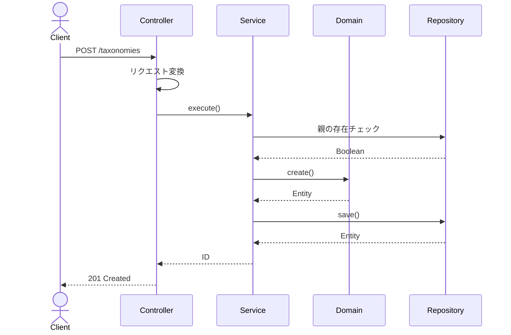
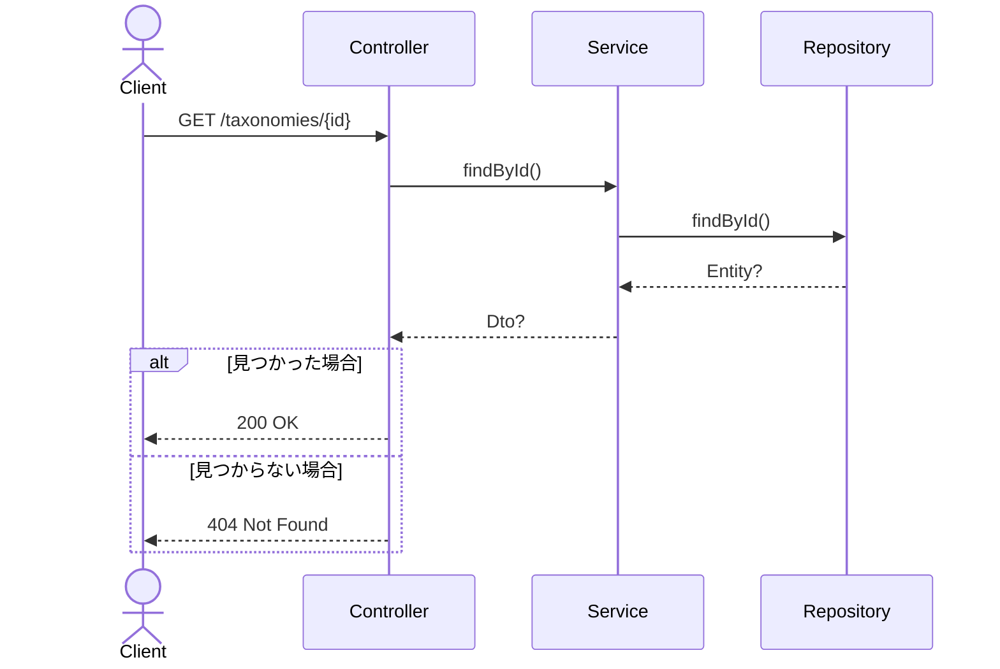

# シーケンス図

## タクソノミー作成（POST）

```mermaid
sequenceDiagram
    actor Client
    participant Controller
    participant Service
    participant Domain
    participant Repository

    Client->>Controller: POST /taxonomies
    Controller->>Controller: リクエスト変換
    Controller->>Service: execute()
    Service->>Repository: 親の存在チェック
    Repository-->>Service: Boolean
    Service->>Domain: create()
    Domain-->>Service: Entity
    Service->>Repository: save()
    Repository-->>Service: Entity
    Service-->>Controller: ID
    Controller-->>Client: 201 Created
```

## タクソノミー取得（GET）

```mermaid
sequenceDiagram
    actor Client
    participant Controller
    participant Service
    participant Repository

    Client->>Controller: GET /taxonomies/{id}
    Controller->>Service: findById()
    Service->>Repository: findById()
    Repository-->>Service: Entity?
    Service-->>Controller: Dto?
    alt 見つかった場合
        Controller-->>Client: 200 OK
    else 見つからない場合
        Controller-->>Client: 404 Not Found
    end
```